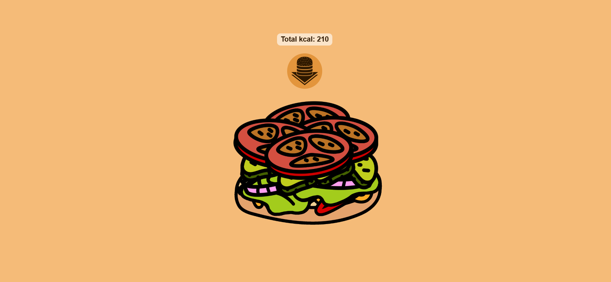

# burger-project

1. Prezentace cheseburgeru. Pár faktu, a počet kalorii za každou vrstvu.

2. V3scools, VScode, HTML, gemini, copilot

3. 
Burger/
│
├── Images/
│   ├── arrow.png
│   ├── bottom_bun.png
│   ├── cheeze.png
│   ├── ketchup.png
│   ├── latuce.png
│   ├── mustard.png
│   ├── onions.png
│   ├── pattie.png
│   ├── pickles.png
│   ├── shadow.png
│   ├── tomatoes.png
│   └── upper_bun.png
│
├── Hamburger.html
└── README.md

4. Technický rozbor:
a. Sloučení kódu do jednoho souboru pro one-page web:
    Teoretický popis řešení: Sloučení kódu do jednoho souboru místo rozdělování projektu do několika externích souboru je u malé jednostránkové aplikace výhodnější mít vše v jednom.
Výstřižek kódu:
<body>
    
    
</body>

b.Využití datových atributů pro výpočet kalorií
    Teorirycky popis řešení: Pro ukládání hodnot přímo do HTML elementů se používal vestavěné data atributy přes DOM
Výstřižek kódu: 

5. AI Deník: AI mnohem pomahal s funkcemi a opravou špatné syntaxe, ale počitatel kalorii a fakty o cheseburgerach skoro uplně vygenerovane.
    zajimavé promty: Jak by ty doporučil a udelal bych, aby když přidavá se ingredient do burgeru, tak nad něj bych psal počet kilokalorii 
    
    (Však originalně psál jsem v anglištině pronty)

6. Instalace a spuštění:
    Stáhněte si celou složku Burger, která obsahuje soubor cheseburger.html a podsložku Images. Otevřete složku Burger ve Visual Studio Code, musite m9t nainstalované rozšíření Live Server, klikněte pravým tlačítkem myši na soubor cheseburger.html a zvolte "Open with Live Server" (Alternativní spuštění: Projekt lze spustit i obyčejným dvojitým kliknutím na soubor cheseburger.html přímo ve správci souborů)

7. 

//I přes to že zadani ja asi ne splníl, mi libilo dělat to zadani

//přepisoval jsem to 3 krat kvuli chybam a "ne perfektní" vyhledu. ;_; však, už je deadline

//to je one page web, jak musím udělat sitemap T_T
